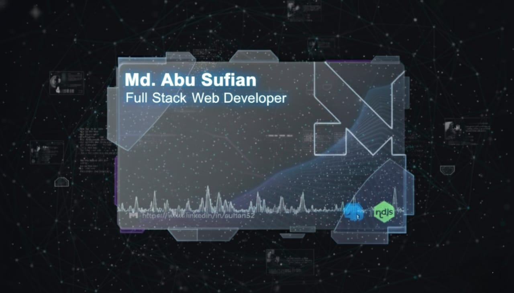

<!-- ─────────────────────────── HERO BANNER ─────────────────────────── -->
<p align="center">
  <a href="https://www.mdabusufian.me/">
    
  </a>
</p>

<div align="center">

## 👋 Hi, I'm **Md. Abu Sufian**


</div>

---

## 🚀 Mission
> **Backend focused, product driven, performance obsessed**

I like building real-world production-ready applications with proper architecture, clean code practices, and maintainability in mind.

---

## 📊 GitHub Stats
<p align="center">
  
</p>

---

## 📬 Connect With Me
<p align="center">
  <a href="https://www.linkedin.com/in/sufian32"></a>
  <a href="https://www.facebook.com/sufian.asr"></a>
  <a href="https://github.com/sufiansar"></a>
  <a href="https://www.mdabusufian.me/"></a>
</p>

---

## 🧰 Technologies & Tools
<p align="center">

<!-- Frontend -->


<br/>

<!-- Frameworks & State -->


<br/>

<!-- Backend & DB -->


<br/>

<!-- Additional -->


</p>

---

## 🧭 Overview
- 🔭 Currently working on **real-world full-stack applications**
- 🌱 Learning **database engineering & scalable backend architecture**
- 🤝 Interested in collaborating on **open-source utilities and backend tools**
- 💡 Love helping others learn development
- ⚡ Debugging brings me more joy than UI design

---

## 📝 Articles
> Coming soon… 🚀

---

### ⭐ If you like my work, consider leaving a star  
```bash
⭐ github.com/sufiansar
