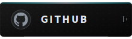
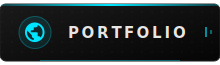

<!-- ─────────────────────────── HERO BANNER ─────────────────────────── -->

  

# 👋 Hi, I'm **Md. Abu Sufian**

 

---

## 🚀 Mission
> **Architecting Scalable Backend Systems & Delivering High-Performance Full-Stack Solutions.**

My core mission is to engineer software that thrives under real-world constraints. I specialize in designing highly scalable, secure, and robust backend architectures while maintaining seamless full-stack integrations. By focusing on clean code, optimal database performance, and future-proof design patterns, I transform complex technical challenges into elegant, resilient, and production-ready systems that gracefully adapt to growing user demands.

---

## 🧭 Overview
- 💼 Currently working as a **Backend Developer** at **SM Technology** *(since February 1st)*
- 🔭 Building and scaling **robust, real-world full-stack applications**
- 🌱 Deep diving into **database engineering & scalable backend architecture**
- 🤝 Always open to collaborating on **open-source utilities and tools**
- 💡 Passionate about helping others learn development and sharing knowledge
- ⚡ Fun fact: Debugging complex server issues brings me more joy than UI design!

---

<h2 align="center">🧰 Technologies & Tools</h2>

  <table width="100%" style="border-collapse: collapse; text-align: center;">
    <tbody>
      <tr>
        <td width="50%" align="center" valign="top">
          <h3>🌐 Frontend</h3>
          
          
          
          
          
          
          
        </td>
        <td width="50%" align="center" valign="top">
          <h3>⚙️ Backend</h3>
          
          
          
          
          
          
        </td>
      </tr>
      <tr>
        <td width="50%" align="center" valign="top">
  <h3>☁️ DevOps</h3>
  
  
  
  
</td>
        <td width="50%" align="center" valign="top">
          <h3>💻 Languages</h3>
          
          
          
          
        </td>
      </tr>
    </tbody>
  </table>

---

<h2 align="center">📊 GitHub Stats</h2>

  

---

  <h2>📬 Connect With Me</h2>
   
  
  
  
  
    
  <i>⭐ If you like my work, consider leaving a star</i>  
  <code>github.com/sufiansar</code>

